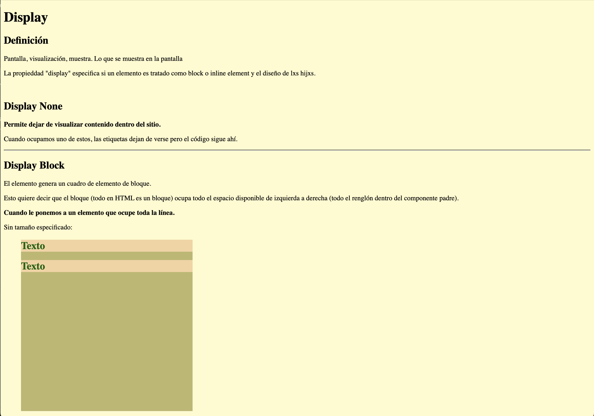

# Apunte Displays 📓  

## Objetivo 🚀  
El objetivo de este trabajo fue, además de tomar notas detalladas sobre el tema, ejemplificar de manera práctica y efectiva los conceptos y teorías que se abordaron en clase durante el BootCamp de TecnoloChicas. Este proyecto se diseñó para permitirnos no solo asimilar la información teórica, sino también aplicar de forma tangible los conocimientos adquiridos, demostrando así nuestra comprensión y habilidades en un contexto real. A través de ejercicios prácticos y ejemplos concretos, pudimos profundizar en los temas vistos en clase, asegurándonos de que cada concepto fuera internalizado y pudiera ser utilizado en futuros proyectos tecnológicos y profesionales.  

## Descripción 📚  
Realicé este proyecto a lo largo del mes de junio del año 2024, en el marco del curso intensivo TECNOLOchicas PRO Bootcamp. Durante este período, me dediqué a aplicar y expandir mis conocimientos en diversas áreas de la tecnología y la programación. El curso, diseñado específicamente para impulsar la participación de mujeres en el campo de la tecnología, me brindó una excelente oportunidad para aprender y practicar nuevas habilidades, culminando en la realización de este proyecto como una demostración de lo aprendido durante esta clase.  

  

[Visítalo](https://startling-gnome-2527c7.netlify.app)  

## Herramientas 🛠️
- HTML  
- CSS
